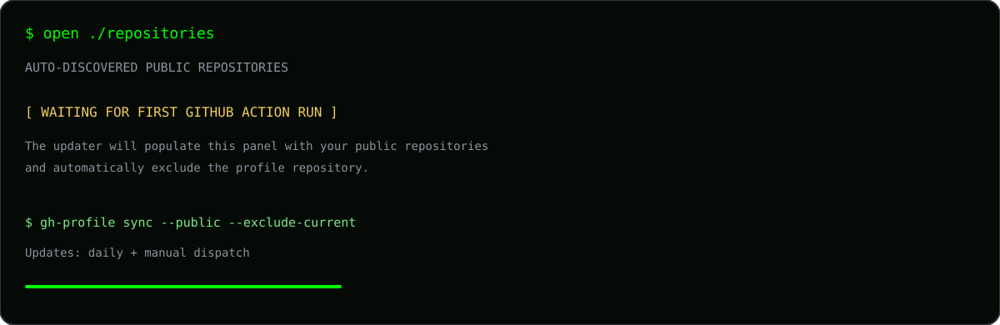

  

  

 

<!-- REPOSITORY_LINKS:START -->
## `$ open ./repositories`

> This section is generated automatically from public repositories. The profile repository itself is excluded automatically.

- Repository list will be generated by GitHub Actions.
<!-- REPOSITORY_LINKS:END -->
