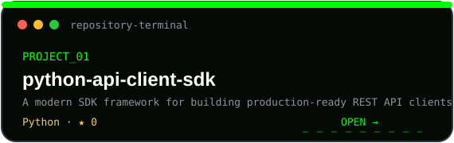
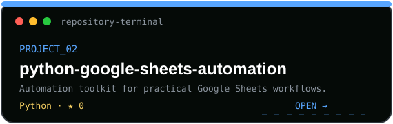

<!-- REPOSITORIES:START -->
<table align="center" width="100%" cellspacing="0" cellpadding="0" border="0">
<tr>
<td width="50%" align="center"></td>
<td width="50%" align="center"></td>
</tr>
</table>
<!-- REPOSITORIES:END -->

