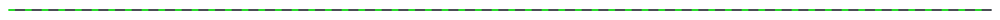
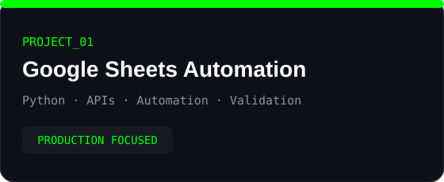
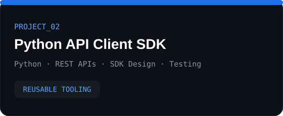
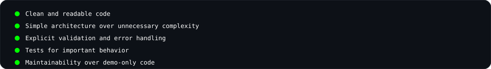
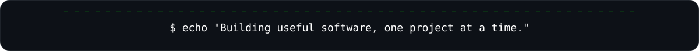

<div align="center">



<br>

<a href="https://github.com/Saeed-Akbarzadeh">
  
</a>
<a href="#featured-projects">
  
</a>
<a href="#tech-stack">
  
</a>

<br><br>



</div>

## `$ whoami`

```text
NAME       : Saeed Akbarzadeh
ROLE       : Python Developer
FOCUS      : Automation · APIs · Web Development
MINDSET    : Clean Code · Testing · Maintainability
WORK MODE  : Remote
```

I build practical software with **Python, APIs, automation, and modern web technologies**.

My focus is on software that is structured, testable, maintainable, and useful in real-world scenarios.

<div align="center">



</div>

## `$ tech --stack`

<div align="center">


<br><br>


</div>

## `$ projects --featured`

<div align="center">




</div>

### 01 · Google Sheets Automation

Production-oriented Python automation for working with Google Sheets APIs and automating repetitive spreadsheet workflows.

**Focus:** Python · Google APIs · Automation · Validation

> Replace the project URL below with the real repository URL when ready.

[View Google Sheets Automation →](PROJECT_1_URL)

### 02 · Python API Client SDK

A reusable Python client focused on structured API communication, validation, error handling, typing, and maintainable architecture.

**Focus:** Python · REST APIs · SDK Design · Testing

> Replace the project URL below with the real repository URL when ready.

[View Python API Client SDK →](PROJECT_2_URL)

## `$ current-focus`

<div align="center">



</div>

## `$ engineering-principles`

<div align="center">



</div>

## `$ github --activity`

<div align="center">


</div>

> The native GitHub contribution graph remains visible on the profile itself. This README visualization is only a supplementary layer.

## `$ roadmap`

```text
[✓] Build production-oriented Python projects
[✓] Build reusable API tooling
[→] Expand backend and automation portfolio
[→] Add modern web projects
[→] Add AI-assisted software projects
[ ] Publish additional case studies
```

## `$ connect`

<div align="center">

<a href="https://github.com/Saeed-Akbarzadeh">
  
</a>

<!-- Add your LinkedIn URL when ready -->
<!--
<a href="YOUR_LINKEDIN_URL">
  
</a>
-->

</div>

<br>

<div align="center">



</div>
